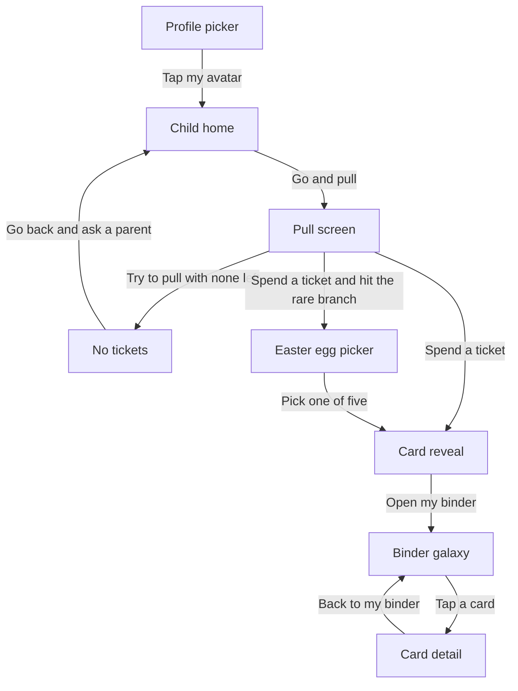
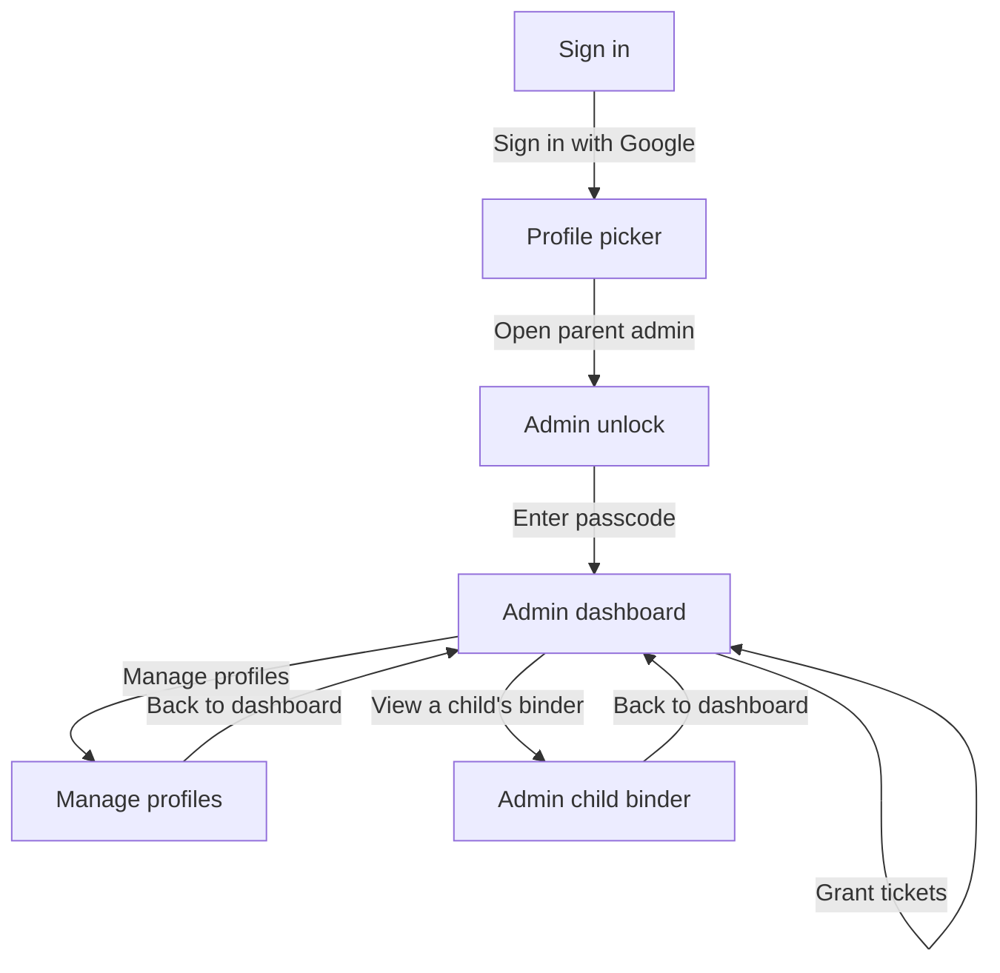

# User Journey — Star Catchers

Generated by aidlc-discovery on 2026-08-03. Sidecar artefact — **not part of the formal AI-DLC handoff
contract**. Alignment aid only, not a specification.

Two journeys, per V1. The three children share one journey *shape*, so the age-7 early reader stands in
for all of them; the parent's journey is genuinely distinct and shares only the profile picker.

Every node is a screen the user actually sees, and every node maps to a real route in the app.

---

## Persona: Child — early reader (age 7)

**Alternative paths drawn, per V2**: *No tickets* is the moment the reward loop does its work — the child
has to go and earn more. *Easter egg picker* is the ~1% branch where a pull becomes a pick-one-of-five.
A happy-path-only diagram would imply a pull always succeeds, which misrepresents the core loop.

---

## Persona: Parent (admin)

**Note on granting tickets**: it is a self-edge, not a separate screen. Granting happens inline on the
admin dashboard in the real app, so drawing it as its own node would invent a screen that does not exist.

---

## Screen list

Exactly the set of unique nodes across both journeys — 13 screens. Ordered by first appearance in the
happy path, starting from the true entry point (parent sign-in).

| # | Screen | Journey | Real route |
|---|--------|---------|------------|
| 01 | Sign in | Parent | `app/(auth)/signin/page.tsx` |
| 02 | Profile picker | **Both** | `app/play/page.tsx` |
| 03 | Child home | Child | `app/play/home/page.tsx` |
| 04 | Pull screen | Child | `app/play/pull/page.tsx` |
| 05 | Card reveal | Child | `app/play/pull/page.tsx` (result view) |
| 06 | Binder galaxy | Child | `app/play/binder/page.tsx` |
| 07 | Card detail | Child | `app/play/binder/[cardId]/page.tsx` |
| 08 | No tickets | Child | `app/play/pull/page.tsx` (zero-balance state) |
| 09 | Easter egg picker | Child | `app/play/pull/page.tsx` (offer state) |
| 10 | Admin unlock | Parent | `app/admin/unlock/page.tsx` |
| 11 | Admin dashboard | Parent | `app/admin/page.tsx` |
| 12 | Manage profiles | Parent | `app/admin/profiles/page.tsx` |
| 13 | Admin child binder | Parent | `app/admin/child/[childId]/binder/page.tsx` |

Mockups: `mockups/index.html` (start here), then `mockups/01-sign-in.html` … `mockups/13-admin-child-binder.html`.

**Not depicted**: trading (`/play/trade`) and quizzes (`/play/learn`) are real, shipped features, but they
are outside both journeys as scoped in V1/V2 — and the Vision classifies both as post-MVP. No screen here
depicts a feature absent from the Vision Document.
