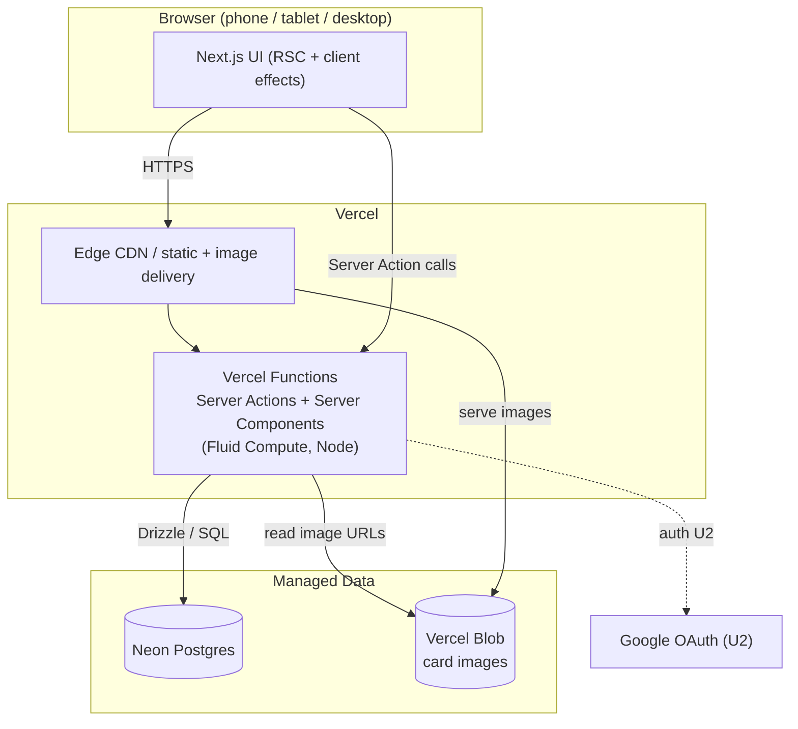

# U1 Foundation & Data — Deployment Architecture

Single Next.js app on Vercel; Neon + Blob attached. Same topology serves every unit.

## Environments
- **Production**: Vercel production deployment + production Neon DB.
- **Preview**: Vercel preview deployments (per push). Can point at the same Neon branch or a Neon dev branch.
- **Local**: `next dev`, env via `vercel env pull`; migrations run against `DATABASE_URL`.

## Deploy flow
1. Provision Neon + Blob via Vercel Marketplace (one-time).
2. Set env (`DATABASE_URL`, `BLOB_READ_WRITE_TOKEN`, later auth secrets).
3. Run migrations.
4. `vercel deploy` (preview) → promote to production.

## Data lifecycle
- Card pool seeded once (U3); rarely changes.
- Children/collections/tokens mutate at runtime.
- Backups: Neon managed. No custom retention.
