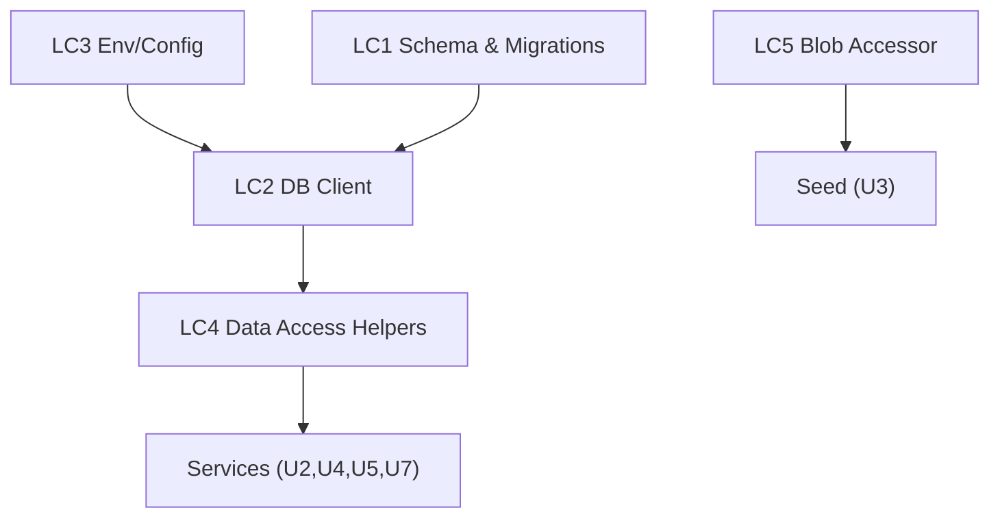

# U1 Foundation & Data — Logical Components

Logical (technology-agnostic) components of the data foundation and how NFRs attach to them. Physical infra (Neon, Blob provisioning) is detailed in Infrastructure Design.

## Components

### LC1 — Schema & Migrations
- **Role**: Define tables (themes, cards, children, collections) + constraints; manage migrations.
- **NFR attach**: integrity constraints (REL-1), check constraints (pullTokens≥0, count≥1), indexes (PERF-1), versioned migrations (TEST-2).

### LC2 — DB Client / Connection
- **Role**: Single Drizzle client over a pooled Neon connection; server-only module.
- **NFR attach**: secret isolation (SEC-2), parameterized access (SEC-1). Connection reuse (Fluid Compute) — no per-request overhead.

### LC3 — Env / Config
- **Role**: Validate + expose required env (`DATABASE_URL`, `BLOB_READ_WRITE_TOKEN`) server-side; fail fast if missing.
- **NFR attach**: SEC-2; reliability (fail fast on misconfig).

### LC4 — Data Access Helpers (repository seam)
- **Role**: Typed query helpers the services call (get child, upsert collection entry, list cards by theme, adjust tokens).
- **NFR attach**: transactional pull seam (REL-2), server-authoritative writes (SEC-4), pure-core separation (TEST-1).

### LC5 — Blob Accessor (interface only in U1)
- **Role**: Interface for storing/reading card images; implementation wired in U3 seed.
- **NFR attach**: publish gate (RES-1).

## Component interaction

## Notes
- No infrastructure middleware (queue/cache/circuit breaker) — intentionally omitted at this scale.
- LC4 is the boundary where pure logic meets persistence; property tests target the pure side, integration tests target LC4.
