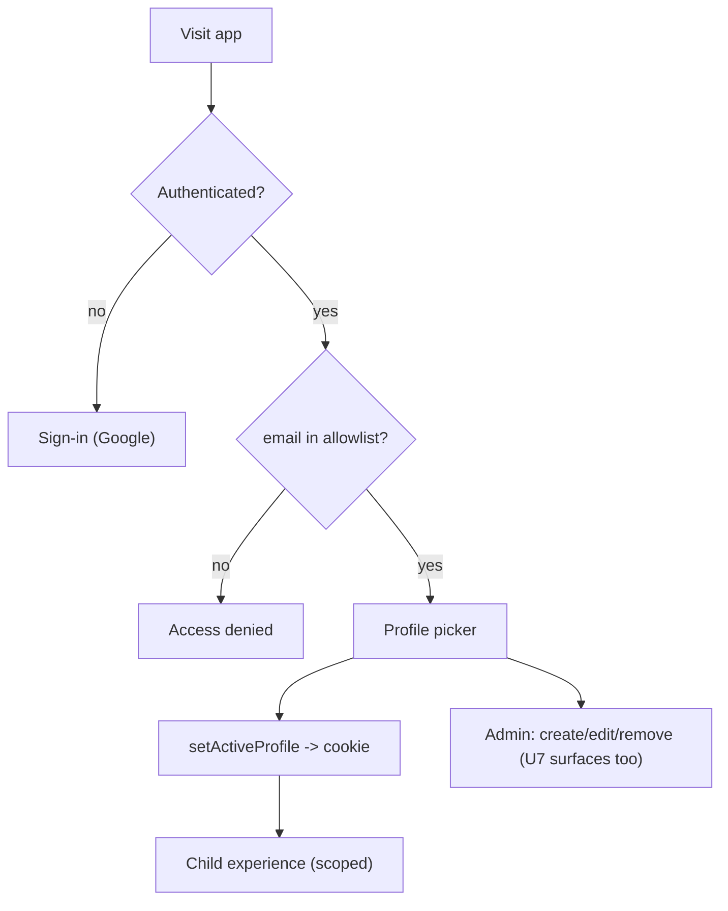

# U2 — Business Logic Model (Auth & Profiles)

## Operations

### isParentEmail(email, allowlist) → boolean  `[SEC][PBT-candidate]`
- Normalize (trim + lowercase) both sides; membership test. Pure → property-testable.

### requireParent() → ParentIdentity  `[SEC]`
- Read Auth.js session server-side; if none or email not allowlisted → throw/redirect to sign-in. Used by every parent/admin action.

### listChildren() → Child[]
- Return all child profiles (parent context).

### createChild({name, avatar}) → Child  `[SEC]`
- `requireParent()`; validate name non-empty + valid avatar; insert with default pullTokens=3 (U1 BR4).

### updateChild(id, {name?, avatar?}) → Child  `[SEC]`
- `requireParent()`; validate; update.

### removeChild(id) → void  `[SEC]`
- `requireParent()`; delete child (cascade collections). UI confirms first (U2-BR7).

### setActiveProfile(childId) → void
- Verify child exists; set signed HTTP-only `activeChildId` cookie.

### getActiveChild() → Child | null  `[SEC]`
- Read cookie server-side; load child; return null if missing/invalid (caller redirects).

### signOut() → void
- Clear session + `activeChildId` cookie.

## Flows

## Test seams
- `isParentEmail` — pure (allowlist normalization) → property test (case/whitespace invariance).
- `getActiveChild` invalid-cookie → null (no leak) — integration test.
