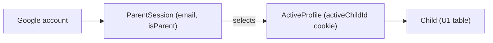

# U2 — Domain Entities (Auth & Session)

U2 adds no persistent tables beyond U1's `children`. It introduces auth/session concepts (mostly runtime, not stored).

## Persistent
- **Child** (from U1): id, name, avatar (preset key), pullTokens. U2 manages CRUD of name+avatar.

## Runtime / session (not stored in app DB)
- **ParentSession**: derived from Auth.js Google session.
  - `email` — the Google account email.
  - `isParent` — true iff `email` ∈ allowlist (`PARENT_EMAILS`).
- **ActiveProfile**: `activeChildId` held in a signed HTTP-only cookie; must reference an existing Child.

## Config
- **Allowlist**: `PARENT_EMAILS` (single email per Q1; comma-split supported for future).
- **Auth secrets**: `AUTH_SECRET`, `AUTH_GOOGLE_ID`, `AUTH_GOOGLE_SECRET` (env only).

## Relationships

