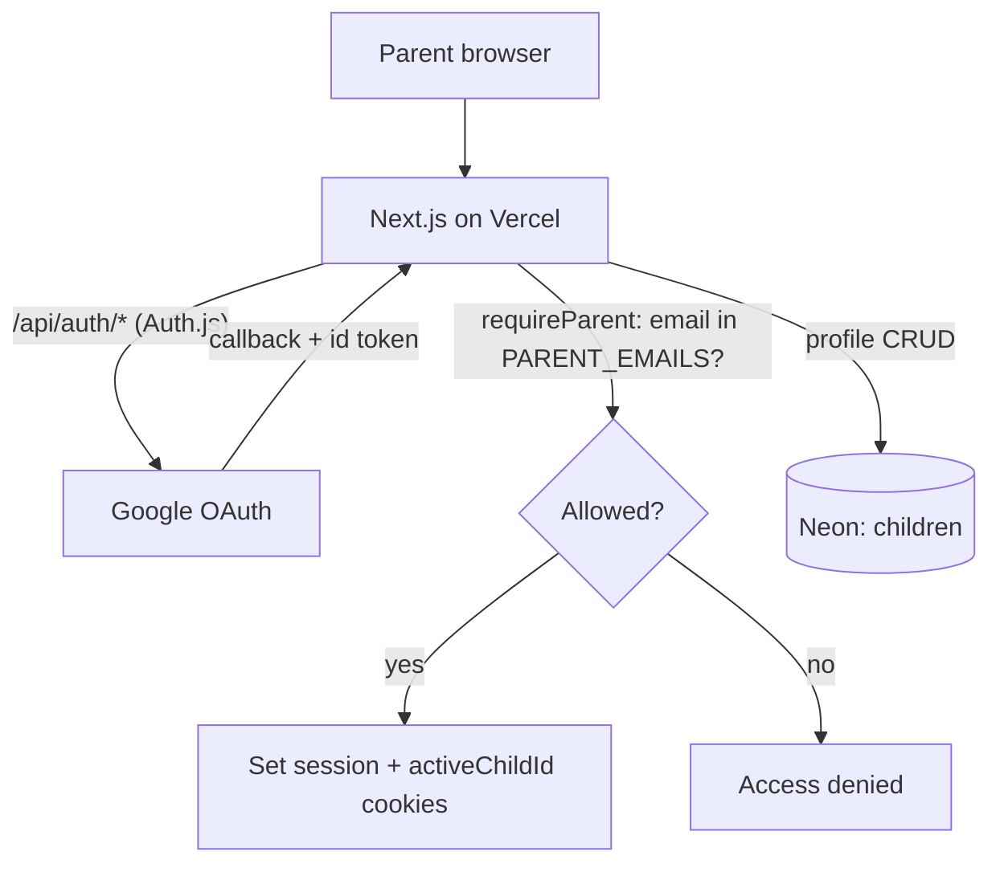

# U2 Auth & Profiles — Deployment Architecture

Same single-app topology as U1, plus the Google OAuth round-trip.

## Auth flow
1. Unauthenticated → SignInScreen → Google OAuth (Auth.js).
2. Callback → Auth.js verifies, sets signed session cookie.
3. `requireParent()` checks email ∈ `PARENT_EMAILS`.
4. Allowed → ProfilePicker → select child → `activeChildId` cookie.

## Environments
- **Prod**: prod Google OAuth redirect URI + Vercel prod env.
- **Preview/local**: add preview + `localhost:3000` redirect URIs in the Google client; env via `vercel env pull`.

## Setup checklist (for Code Gen / deploy)
- [ ] Create Google OAuth client; add redirect URIs.
- [ ] Set `AUTH_SECRET`, `AUTH_GOOGLE_ID/SECRET`, `PARENT_EMAILS` in Vercel.
- [ ] Mount Auth.js route handler; add `requireParent` + cookie helpers.
