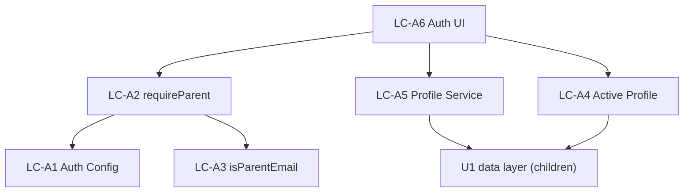

# U2 Auth & Profiles — Logical Components

## Components

### LC-A1 — Auth Config
- **Role**: Auth.js setup (Google provider, secret, callbacks). Exposes `auth()`, sign-in/out handlers.
- **NFR attach**: U2-SEC-1/4/8 (provider, signed session, OAuth state).

### LC-A2 — Authorization Guard (`requireParent`)
- **Role**: Server-side policy enforcement point; session → allowlist check → parent identity or redirect.
- **NFR attach**: U2-SEC-2/3, fail-closed (U2-REL-2).

### LC-A3 — Allowlist Policy (`isParentEmail`)
- **Role**: Pure allowlist membership (normalized).
- **NFR attach**: U2-SEC-3; testability U2-TEST-1.

### LC-A4 — Active Profile Session
- **Role**: Set/read/clear signed `activeChildId` cookie; resolve current child server-side.
- **NFR attach**: U2-SEC-4/6/7.

### LC-A5 — Profile Service
- **Role**: CRUD children (parent-gated), validate name/avatar.
- **NFR attach**: U2-SEC-5 input validation; reuses U1 data layer.

### LC-A6 — Auth UI
- **Role**: SignInScreen, ProfilePicker, ProfileManager, SwitchProfile, ConfirmDialog.
- **NFR attach**: U2-UX-1/2 (large targets, one-tap, pre-reader friendly).

## Interaction

## Notes
- LC-A2 is the single choke point for parent authz; all parent/admin paths route through it.
- LC-A3 is the only pure piece → property test; the rest are integration-tested.
