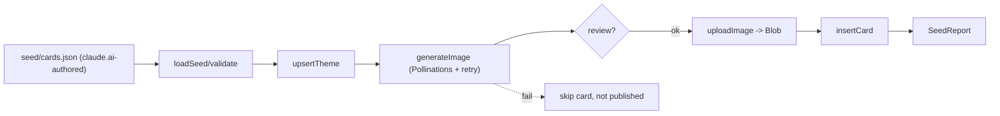

# U3 — Business Logic Model (Pool & Seeding)

Offline pipeline (a script, not in the request path → zero per-pull cost).

## Pipeline steps
1. **loadSeed(path)** → parse + validate `seed/cards.json` (U3-BR1/BR2).
2. For each theme: **upsertTheme(name)** → themeId (skip if exists, BR8).
3. For each card (not already published, BR8):
   a. **buildPrompt(card)** → `imagePrompt` + style suffix (BR5).
   b. **generateImage(prompt)** → bytes via Pollinations.ai, with bounded retry (BR4).
   c. **review** (optional gate): write to a review folder; on confirm continue (BR6).
   d. **uploadImage(bytes)** → Blob URL.
   e. **insertCard(themeId, card, imageUrl)** (BR7).
4. **report** counts (themes/cards created, skipped, failed).

## Operations
### loadSeed(path) → ThemeSeed[]
- Parse JSON, validate each card (throw on invalid → fail fast before any DB write).

### generateImage(prompt) → Uint8Array  `[RES]`
- GET `https://image.pollinations.ai/prompt/<encoded prompt>?width=...&height=...&nologo=true`.
- Retry up to N times on network/non-200; throw after exhaustion → card skipped, not published.

### seedPool(seed, { review }) → SeedReport  `[SEC]`
- Orchestrates steps 2–4 idempotently; respects review gate; never publishes a card without a valid imageUrl.

## Data flow

## claude.ai text-authoring prompt (deliverable in Code Gen)
- Code Gen will ship a ready-to-paste prompt that instructs claude.ai to emit valid `cards.json` (3 themes × ~12, pyramid rarity, short kid-facts, kid-cartoon imagePrompts), matching the schema in domain-entities.md.

## Test seams
- `loadSeed` validation (reject malformed/missing fields).
- `buildPrompt` includes style suffix (pure).
- `generateImage` retry/abort behavior (mock fetch).
