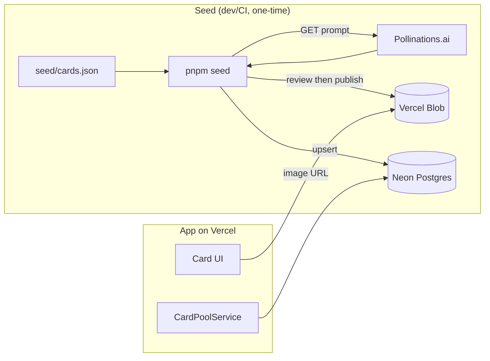

# U3 Pool & Seeding — Deployment Architecture

Seed is an **offline batch**; runtime only reads the pool.

## Seed run flow
1. Author/commit `seed/cards.json` (via claude.ai prompt).
2. `pnpm seed --review` → generate images to a review folder; eyeball them.
3. `pnpm seed --publish` → upload to Blob + upsert themes/cards (idempotent).
4. App reads the pool at runtime; no generation.

## Environments
- Seed against the same Neon DB the app uses (or a Neon branch for staging).
- Re-runnable safely (idempotent) to add cards later.

## Setup checklist (for Code Gen)
- [ ] `seed/cards.json` + schema/sample
- [ ] `scripts/seed/` (loader, generator, uploader, writer, CLI)
- [ ] `pnpm seed` script + `@vercel/blob` dep
- [ ] claude.ai authoring prompt committed
