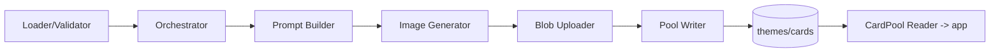

# U3 Pool & Seeding — Logical Components

## Components

### LC-S1 — Seed Loader/Validator
- **Role**: Read + validate `seed/cards.json` (Zod). Pure.
- **NFR**: fail-fast (U3-RES-3); testable (U3-TEST-1).

### LC-S2 — Prompt Builder
- **Role**: `buildPrompt(card)` → `imagePrompt` + kid-cartoon style suffix. Pure.
- **NFR**: consistency (U3-BR5); testable.

### LC-S3 — Image Generator (Pollinations)
- **Role**: `generateImage(prompt, {fetchImpl, retries})` → bytes, bounded retry.
- **NFR**: resiliency (U3-RES-1); injected fetch for tests.

### LC-S4 — Blob Uploader
- **Role**: upload bytes → public Blob URL (`@vercel/blob`).
- **NFR**: secret confinement (U3-SEC-3); publish atomicity (U3-SEC-2).

### LC-S5 — Pool Writer
- **Role**: idempotent upsert of themes + cards (Drizzle).
- **NFR**: idempotent resume (U3-RES-2); no-publish-without-image (U3-SEC-2).

### LC-S6 — Seed Orchestrator (CLI)
- **Role**: `seedPool(seed, {review, concurrency})`; wires S1–S5; review gate; report.
- **NFR**: human review (U3-SEC-1); concurrency cap (U3-PERF-1).

### LC-S7 — CardPool Reader (runtime)
- **Role**: `listThemes`, `listCards`, `getCard` for the app (U4/U5/U6 consume).
- **NFR**: simple reads; no generation at runtime.

## Interaction

## Notes
- S1–S6 are offline (script); S7 is the only runtime piece.
- S3 is the resiliency hot spot (free external service) — retry + skip + report.
