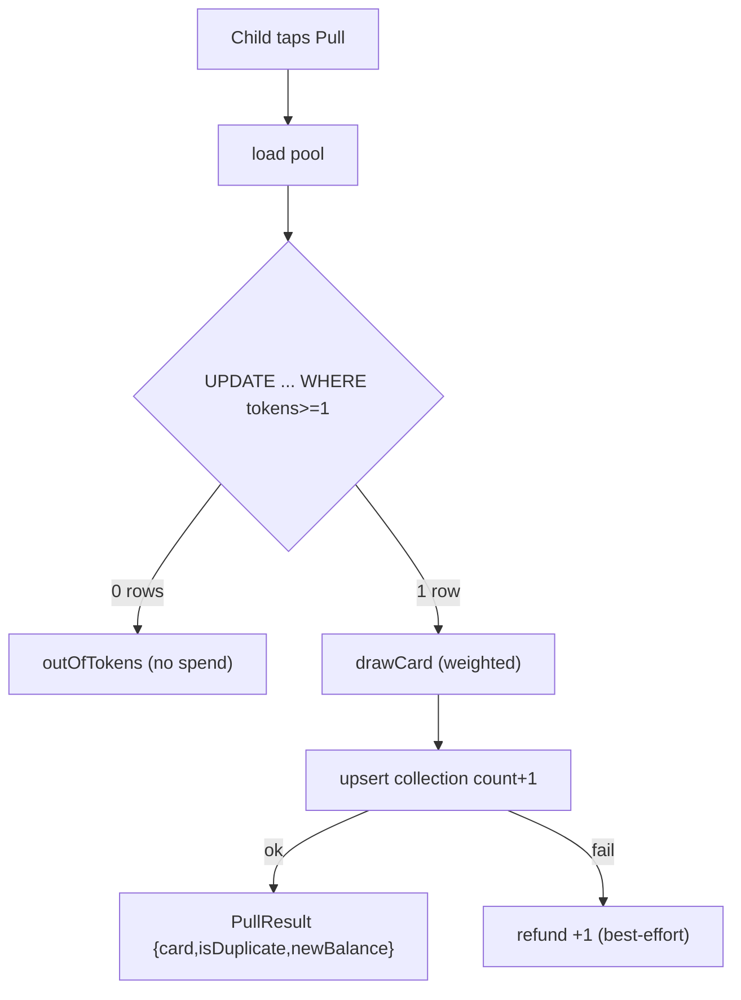

# U4 — Business Logic Model (Pull & Rewards)

Builds on U1 pure logic (`drawCard`, `applyPull`, `grantTokens`) + U3 pool reader. The DB-bound orchestration lives here.

## pull(childId) → PullResult  `[SEC][PBT]`
Order avoids side effects before the atomic guard:
1. Load active pool via `CardPoolService.listCards()` (eligible cards only).
2. **Atomic spend (no double-spend):**
   `UPDATE children SET pull_tokens = pull_tokens - 1 WHERE id = :childId AND pull_tokens >= 1 RETURNING pull_tokens` (Q1-A).
   - 0 rows → **out of tokens**: return `{ outOfTokens: true }`, nothing drawn, nothing spent (C3).
   - 1 row → `newBalance` is the returned value (exactly one spent).
3. `card = drawCard(pool)` (U1 BR1, rarity-weighted).
4. **Upsert collection** (atomic single statement):
   `INSERT INTO collections (child_id, card_id, count) VALUES (...,1) ON CONFLICT (child_id, card_id) DO UPDATE SET count = collections.count + 1 RETURNING count` → `isDuplicate = returnedCount > 1`.
5. On step-4 failure → **best-effort refund** (`UPDATE children SET pull_tokens = pull_tokens + 1 WHERE id = :childId`); log if refund fails (Q2-A).
6. Return `{ card, isDuplicate, newBalance }`.

## getBalance(childId) → number
- Read `children.pull_tokens`. Used by F2 + pull screen.

## grantTokens(childId, n) → number  `[SEC][PBT]`  (F1)
- `requireParent()`.
- `n` is a positive integer (or signed adjust). `UPDATE children SET pull_tokens = GREATEST(0, pull_tokens + :n) WHERE id = :childId RETURNING pull_tokens` (BR5 non-negative).
- Returns new balance.

## Concurrency / correctness
- The conditional UPDATE is the single source of truth for "can spend": two rapid taps → second sees `pull_tokens >= 1` false (or decrements again only if balance allows). Never spends below 0; never double-spends a single token.

## Data flow

## Test seams `[PBT]`
- Pure `drawCard`/`applyPull`/`grantTokens` already property-tested in U1.
- U4 integration tests (Build & Test): no-double-spend under concurrent pulls; out-of-tokens no-spend; duplicate increments count; grant non-negative.
