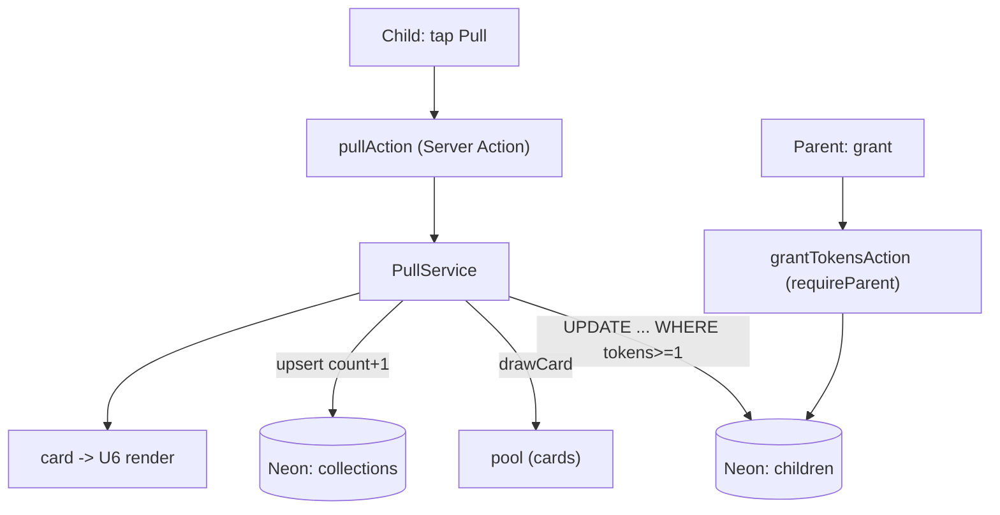

# U4 Pull & Rewards — Deployment Architecture

Same shared topology; U4 adds gameplay paths only.

## Deploy
- No new setup; ships with the existing Vercel app + Neon.
- No new env vars or external integrations.

## Notes
- Pull/grant are ordinary Server Actions on the deployed app.
- All U4 correctness is in DB statements — nothing infra-specific to provision.
