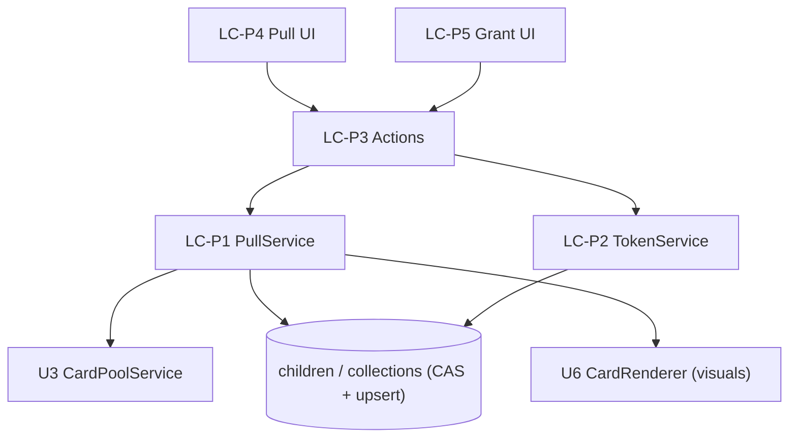

# U4 Pull & Rewards — Logical Components

## Components

### LC-P1 — PullService
- **Role**: `pull(childId)` orchestration (CAS spend → draw → upsert → refund-on-fail).
- **NFR**: U4-SEC-1/2, REL-1/2; reuses U1 `drawCard`, U3 pool reader.

### LC-P2 — TokenService
- **Role**: `getBalance`, `grant(childId, n)` (parent-only, clamp ≥ 0).
- **NFR**: U4-SEC-3/4, BR8.

### LC-P3 — Pull Actions
- **Role**: Server Actions `pullAction` (active child), `grantTokensAction` (requireParent).
- **NFR**: authz reuse (U2), CSRF-safe.

### LC-P4 — Pull UI
- **Role**: PullScreen, PullButton, TokenBalance, RevealResult, OutOfTokens.
- **NFR**: UX (large button, disabled state), hands card to U6 renderer.

### LC-P5 — Grant UI (admin)
- **Role**: per-child grant input + quick buttons (rendered in U7 admin).
- **NFR**: parent-only.

## Interaction

## Notes
- All correctness concentrated in LC-P1's two atomic statements.
- LC-P4 depends on U6 for the actual card render/effects (integration point).
