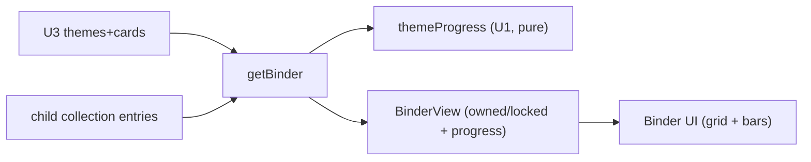

# U5 — Business Logic Model (Binder & Collection)

Read-only views over the active child's collection + the shared pool. Uses U1 `themeProgress` (pure) for D2.

## getBinder(childId) → BinderView  `[PBT-adjacent]`
1. Load all themes + cards (U3 `listThemes`, `listCards`).
2. Load the child's collection entries (`SELECT child_id, card_id, count`).
3. For each theme, build a `ThemeSection`:
   - `cards`: each pool card annotated `{ card, owned: boolean, count: number }` (unowned → owned=false, locked slot).
   - `progress`: `themeProgress(entries, themeCardIds)` → `{ owned, total, complete }` (U1 BR11).
4. Return `{ themes: ThemeSection[] }` (empty collection → all locked, all progress 0/total).

## getCardDetail(childId, cardId) → OwnedCard | null  `[SEC]`
- Return the card + owned count **only if the child owns it** (count ≥ 1); else null (can't inspect unowned).

## Shapes
```
ThemeSection = { theme: Theme, cards: BinderCard[], progress: {owned,total,complete} }
BinderCard   = { card: Card, owned: boolean, count: number }
BinderView   = { themes: ThemeSection[], totalOwned: number, totalCards: number }
```

## Data flow


## Test seams `[PBT]`
- `themeProgress` already property-tested (U1): 0 ≤ owned ≤ total, complete iff owned==total.
- U5 mapping test: a card in the collection → owned=true with correct count; not in collection → owned=false, count 0.
