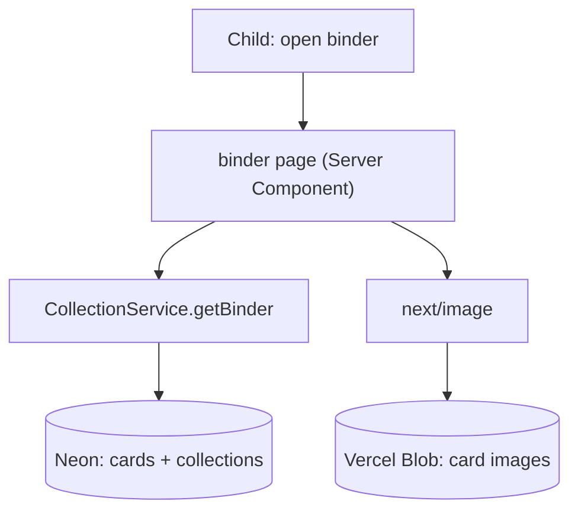

# U5 Binder & Collection — Deployment Architecture

Shared topology; U5 adds read-only binder paths.

```mermaid
flowchart TD
    Child["Child: open binder"] --> Page["binder page (Server Component)"]
    Page --> SVC["CollectionService.getBinder"]
    SVC --> Neon[("Neon: cards + collections")]
    Page --> Img["next/image"]
    Img --> Blob[("Vercel Blob: card images")]
```

## Deploy
- No new setup, env, or integrations. Ships with the existing app.
