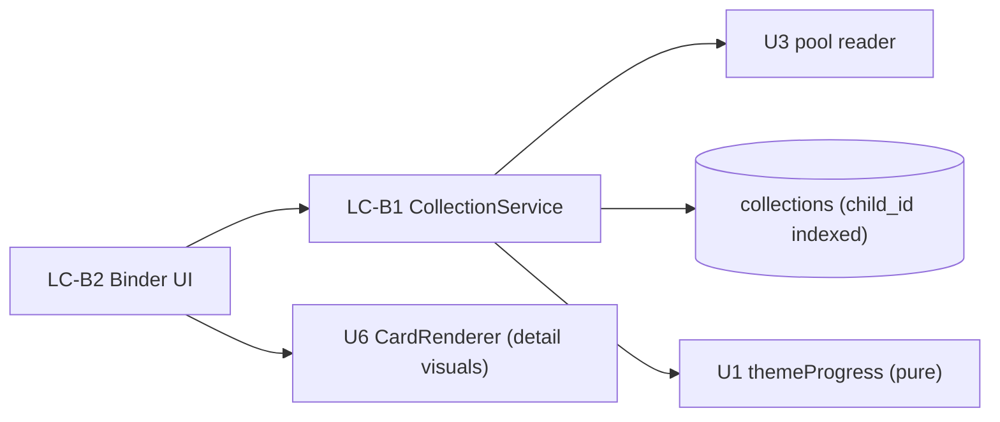

# U5 Binder & Collection — Logical Components

## Components
### LC-B1 — CollectionService
- **Role**: `getBinder(childId)` (assemble ThemeSections + progress), `getCardDetail(childId, cardId)` (owned-only).
- **NFR**: U5-SEC-1/2, PERF-1; reuses U1 `themeProgress` + U3 pool reader.

### LC-B2 — Binder UI
- **Role**: BinderPage, ThemeSection, ProgressBar, CardSlot (owned/locked), CardDetail, EmptyState.
- **NFR**: A11Y (non-color, text progress, large targets), lazy images.

## Interaction

## Notes
- Entirely read-side; no writes.
- Card visuals delegate to U6; U5 ships a placeholder until then.
