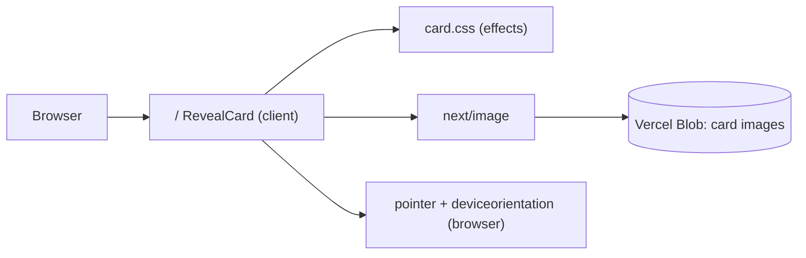

# U6 Card UI & Effects — Deployment Architecture

Client-only; ships in the existing app bundle.

```mermaid
flowchart LR
    Browser["Browser"] --> Card["<Card> / RevealCard (client)"]
    Card --> CSS["card.css (effects)"]
    Card --> Img["next/image"]
    Img --> Blob[("Vercel Blob: card images")]
    Card --> APIs["pointer + deviceorientation (browser)"]
```

## Deploy
- No new setup, env, or integrations. Component + CSS bundle with the app.
