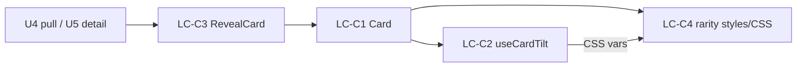

# U6 Card UI & Effects — Logical Components

## Components
### LC-C1 — Card (client)
- **Role**: render rarity-framed card (image, name, rarity, eduText) + apply effects when interactive.
- **NFR**: PERF (CSS vars), A11Y (reduced-motion, non-color), RES (degrade).

### LC-C2 — useCardTilt (hook)
- **Role**: attach pointer + deviceorientation, rAF-throttled writes to CSS vars; no-op under reduced motion; cleanup on unmount; iOS permission handling.
- **NFR**: PERF-2/3, A11Y-1/4.

### LC-C3 — RevealCard (client)
- **Role**: pack-open flip → front → becomes interactive Card; reduced-motion skips flip.
- **NFR**: A11Y-1 (C2).

### LC-C4 — rarity styles (pure + CSS)
- **Role**: `rarityClass(rarity)` + `card.css` (frames, holo keyframes, tilt vars, reduced-motion media query).
- **NFR**: A11Y-2, testable.

## Interaction

## Notes
- Presentational; consumes already-authorized `Card` data.
- Single `<Card>` replaces the U4/U5 `PullResultView` placeholders.
