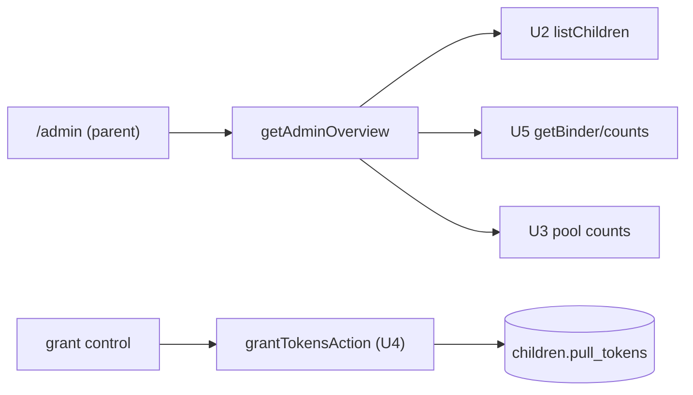

# U7 — Business Logic Model (Admin)

Mostly composition of existing services (U2 profiles, U4 token grant, U5 collection). Parent-only.

## getAdminOverview() → AdminOverview  `[SEC]`
- `requireParent()`.
- For each child (U2 `listChildren`): balance + overall progress (owned distinct / total pool cards) via U5 `getBinder(child.id)` (or a lighter count query).
- Pool summary: theme count + card count (U3 `listThemes`/`listCards`).
- Returns `{ children: {child, balance, owned, total}[], themes: number, cards: number }`.

## grantTokensAction(childId, amount)  `[SEC][PBT]`  (F1 — already in U4)
- Reused from U4; wired to the admin grant UI. `requireParent`; positive integer; balance ≥ 0.

## Profile CRUD (A2 — already in U2)
- `createChild`/`updateChild`/`removeChild` reused; surfaced on the same admin screen.

## Read-only child binder (G1)
- Admin links to a read-only view of a child's binder (reuse U5 `getBinder` rendering; parent-gated).

## Shapes
```
AdminChildRow = { child: Child, balance: number, owned: number, total: number }
AdminOverview = { children: AdminChildRow[], themes: number, cards: number }
```

## Data flow


## Notes
- No new persistence. U7 is composition + UI over existing services.
- Efficiency: overview may use a light `COUNT` per child rather than full `getBinder` if the pool grows.
