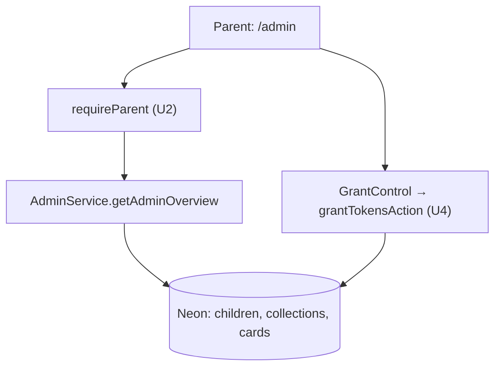

# U7 Admin — Deployment Architecture

Shared topology; U7 adds parent-only admin paths.

```mermaid
flowchart TD
    Parent["Parent: /admin"] --> Guard["requireParent (U2)"]
    Guard --> OV["AdminService.getAdminOverview"]
    OV --> Neon[("Neon: children, collections, cards")]
    Parent --> Grant["GrantControl → grantTokensAction (U4)"]
    Grant --> Neon
```

## Deploy
- No new setup, env, or integrations. Ships with the existing app.
