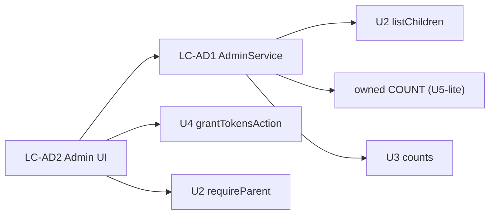

# U7 Admin — Logical Components

## Components
### LC-AD1 — AdminService
- **Role**: `getAdminOverview()` — compose child list + owned-count + pool counts (parent-gated).
- **NFR**: U7-SEC-1, PERF-1 (aggregate query).

### LC-AD2 — Admin UI
- **Role**: AdminDashboard, ChildAdminRow, GrantControl, read-only child binder.
- **NFR**: A11Y (responsive), REL (grant errors). Reuses U5 ProgressBar + binder rendering.

### Reused (no new code)
- U2 `requireParent`, profile CRUD; U4 `grantTokensAction`; U5 `getBinder`/ProgressBar; U3 pool reader.

## Interaction

## Notes
- U7 is thin: one read service + UI, everything else reused.
