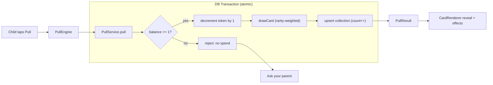
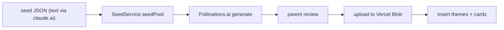

# Component Dependencies

## Dependency matrix (→ depends on)
| Component | Depends on |
|---|---|
| AuthGate | AuthService |
| ProfilePicker | AuthService, ProfileService |
| PullEngine | AuthService, PullService, CardPoolService, CardRenderer |
| CardRenderer | (none — presentational; consumes Card data) |
| Binder | AuthService, CollectionService, CardRenderer |
| RewardManager | AuthService, TokenService |
| AdminPanel | AuthService, ProfileService, TokenService, CollectionService, CardPoolService |
| CardPool/Seeder | SeedService, CardPoolService (read), Blob, DB |

## Service-level dependencies
| Service | Depends on |
|---|---|
| AuthService | Auth.js, env allowlist |
| ProfileService | DB, AuthService |
| PullService | DB (txn), CardPoolService, CollectionService, TokenService, AuthService |
| CollectionService | DB |
| TokenService | DB, AuthService |
| CardPoolService | DB |
| SeedService | Pollinations.ai, Blob, DB |

## Communication patterns
- UI → Services via **Server Actions** (mutations) / **Server Components** (reads). No direct DB access from client.
- Services → DB via **Drizzle** (PullService uses a transaction for atomic spend+draw+upsert).
- SeedService runs **offline** (script), not in the request path → zero runtime AI cost.
- Authorization is centralized: every parent/admin action calls `AuthService.requireParent()`.

## Data flow — Pull (critical path)

## Data flow — Seed (offline)

## Notes
- **No cycles**: PullService composes Token/Collection/CardPool services (shared, not circular).
- **CardRenderer** intentionally dependency-free (presentational) for reuse in pull, binder, and admin views.
