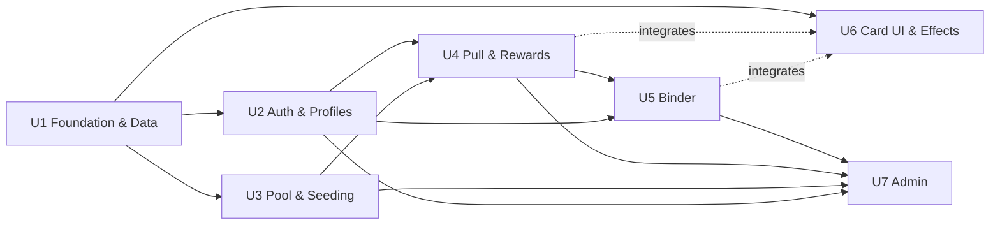

# Unit of Work — Dependency Matrix

## Matrix (✓ = depends on)
| Unit ↓ depends on → | U1 | U2 | U3 | U4 | U5 | U6 | U7 |
|---|----|----|----|----|----|----|----|
| **U1 Foundation & Data** | — | | | | | | |
| **U2 Auth & Profiles** | ✓ | — | | | | | |
| **U3 Pool & Seeding** | ✓ | | — | | | | |
| **U4 Pull & Rewards** | ✓ | ✓ | ✓ | — | | | |
| **U5 Binder** | ✓ | ✓ | | ✓ | — | | |
| **U6 Card UI & Effects** | ✓ | | | (∘) | (∘) | — | |
| **U7 Admin** | ✓ | ✓ | ✓ | ✓ | ✓ | | — |

✓ = hard dependency; (∘) = integration touchpoint (U6 is presentational, consumed by U4 reveal and U5 detail, but doesn't hard-depend on their logic).

## Build Order (topological)

## Critical Path
**U1 → U3 → U4 → U5 → U7** (pool must exist before pull; pull before binder; binder before full admin oversight).

## Parallelization Opportunities
- After U1: **U2, U3, U6** can proceed in parallel.
- U6 (effects) can be developed against mock card data, independent of U4/U5 logic.

## Notes
- No circular dependencies.
- U6 is intentionally low-coupling (presentational) so it integrates into multiple consumers without depending on their internals.
