# Execution Plan

## Detailed Analysis Summary

### Change Impact Assessment
- **User-facing changes**: Yes — entire product (auth, profile select, pull, binder, card view + effects, rewards).
- **Structural changes**: Yes — greenfield app architecture (Next.js App Router on Vercel).
- **Data model changes**: Yes — new schemas (children, cards, themes, collections, tokens).
- **API changes**: Yes — new server routes/actions (auth, pull, grant tokens, fetch collection, admin).
- **NFR impact**: Yes — security (auth/authorization), performance (60fps effects), accessibility (pre-reader/reduced-motion), resiliency (seed/image-service failures), testability (PBT on core logic).

### Risk Assessment
- **Risk Level**: Low–Medium (greenfield, private family app; main risks are AI image quality/safety at seed time and effect performance on low-end devices).
- **Rollback Complexity**: Easy (no production users beyond family; Vercel preview/rollback).
- **Testing Complexity**: Moderate (property-based tests required on draw/token/collection logic).

## Workflow Visualization

```mermaid
flowchart TD
    Start(["User Request"])

    subgraph INCEPTION["INCEPTION PHASE"]
        WD["Workspace Detection<br/><b>COMPLETED</b>"]
        RA["Requirements Analysis<br/><b>COMPLETED</b>"]
        US["User Stories<br/><b>COMPLETED</b>"]
        WP["Workflow Planning<br/><b>IN PROGRESS</b>"]
        AD["Application Design<br/><b>EXECUTE</b>"]
        UG["Units Generation<br/><b>EXECUTE</b>"]
    end

    subgraph CONSTRUCTION["CONSTRUCTION PHASE"]
        FD["Functional Design<br/><b>EXECUTE</b>"]
        NFRA["NFR Requirements<br/><b>EXECUTE</b>"]
        NFRD["NFR Design<br/><b>EXECUTE</b>"]
        ID["Infrastructure Design<br/><b>EXECUTE</b>"]
        CG["Code Generation<br/><b>EXECUTE</b>"]
        BT["Build and Test<br/><b>EXECUTE</b>"]
    end

    subgraph OPERATIONS["OPERATIONS PHASE"]
        OPS["Operations<br/><b>PLACEHOLDER</b>"]
    end

    Start --> WD
    WD --> RA
    RA --> US
    US --> WP
    WP --> AD
    AD --> UG
    UG --> FD
    FD --> NFRA
    NFRA --> NFRD
    NFRD --> ID
    ID --> CG
    CG --> BT
    BT --> OPS
    OPS --> End(["Complete"])

    style WD fill:#4CAF50,stroke:#1B5E20,stroke-width:3px,color:#fff
    style RA fill:#4CAF50,stroke:#1B5E20,stroke-width:3px,color:#fff
    style US fill:#4CAF50,stroke:#1B5E20,stroke-width:3px,color:#fff
    style WP fill:#4CAF50,stroke:#1B5E20,stroke-width:3px,color:#fff
    style AD fill:#FFA726,stroke:#E65100,stroke-width:3px,stroke-dasharray: 5 5,color:#000
    style UG fill:#FFA726,stroke:#E65100,stroke-width:3px,stroke-dasharray: 5 5,color:#000
    style FD fill:#FFA726,stroke:#E65100,stroke-width:3px,stroke-dasharray: 5 5,color:#000
    style NFRA fill:#FFA726,stroke:#E65100,stroke-width:3px,stroke-dasharray: 5 5,color:#000
    style NFRD fill:#FFA726,stroke:#E65100,stroke-width:3px,stroke-dasharray: 5 5,color:#000
    style ID fill:#FFA726,stroke:#E65100,stroke-width:3px,stroke-dasharray: 5 5,color:#000
    style CG fill:#4CAF50,stroke:#1B5E20,stroke-width:3px,color:#fff
    style BT fill:#4CAF50,stroke:#1B5E20,stroke-width:3px,color:#fff
    style OPS fill:#BDBDBD,stroke:#424242,stroke-width:2px,stroke-dasharray: 5 5,color:#000
    style Start fill:#CE93D8,stroke:#6A1B9A,stroke-width:3px,color:#000
    style End fill:#CE93D8,stroke:#6A1B9A,stroke-width:3px,color:#000

    linkStyle default stroke:#333,stroke-width:2px
```

## Phases to Execute

### 🔵 INCEPTION PHASE
- [x] Workspace Detection (COMPLETED)
- [x] Requirements Analysis (COMPLETED)
- [x] User Stories (COMPLETED)
- [x] Workflow Planning (IN PROGRESS)
- [ ] Application Design - **EXECUTE**
  - **Rationale**: New components, services, and data models must be defined (auth, pull engine, collection, card render, rewards/admin, seeding).
- [ ] Units Generation - **EXECUTE**
  - **Rationale**: System decomposes into several independently-buildable units; explicit units enable ordered construction and clean dependencies.

### 🟢 CONSTRUCTION PHASE (per unit)
- [ ] Functional Design - **EXECUTE**
  - **Rationale**: Each unit has non-trivial behavior + acceptance criteria to design against.
- [ ] NFR Requirements - **EXECUTE**
  - **Rationale**: Security + PBT enabled (blocking), plus performance/a11y/resiliency targets.
- [ ] NFR Design - **EXECUTE**
  - **Rationale**: Translate NFRs into concrete design (authz model, draw correctness, effect perf budget, reduced-motion).
- [ ] Infrastructure Design - **EXECUTE**
  - **Rationale**: Real infra to wire — Vercel, Google OAuth, Postgres (Neon), Blob, env/secrets, seed pipeline.
- [ ] Code Generation - **EXECUTE** (ALWAYS)
  - **Rationale**: Build the app + seed tooling.
- [ ] Build and Test - **EXECUTE** (ALWAYS)
  - **Rationale**: Build, property-based + integration tests, manual verification.

### 🟡 OPERATIONS PHASE
- [ ] Operations - **PLACEHOLDER** (deploy to Vercel handled at Build & Test / manual).

## Proposed Units of Work (refined in Units Generation)
1. **U1 — Foundation & Data**: Next.js scaffold, Postgres schema, Blob, env config.
2. **U2 — Auth & Profiles**: Google OAuth (parent allowlist), child profile select.
3. **U3 — Card Pool & Seeding**: seed JSON (text via claude.ai prompt), free image-gen pipeline → Blob, load to DB.
4. **U4 — Pull Engine & Rewards**: rarity-weighted draw, token spend/grant, duplicates (PBT-covered).
5. **U5 — Binder & Collection**: per-child collection view, theme grouping, progress.
6. **U6 — Card UI & Effects**: holo/3D/rarity-scaled/reveal, reduced-motion, responsive.
7. **U7 — Admin**: profile mgmt, token grants, oversight.

Dependency sketch: U1 → U2/U3 → U4 → U5/U6 → U7.

## Estimated Timeline
- **Total executing stages**: 4 inception/construction design stages + code + test, across ~7 units.
- **Estimated Duration**: Iterative; build unit-by-unit. (No fixed dates — personal project.)

## Success Criteria
- **Primary Goal**: Deployable Vercel app where the parent signs in, grants pull tokens, and each child pulls/collects/views themed rarity cards with effects.
- **Key Deliverables**: Working app, seeded card pool, parent admin, PBT + integration tests, deploy.
- **Quality Gates**: Security rules satisfied (authz, allowlist, no double-spend); PBT passing on draw/token/collection/progress; effects smooth + reduced-motion honored; kid-safe reviewed pool.
